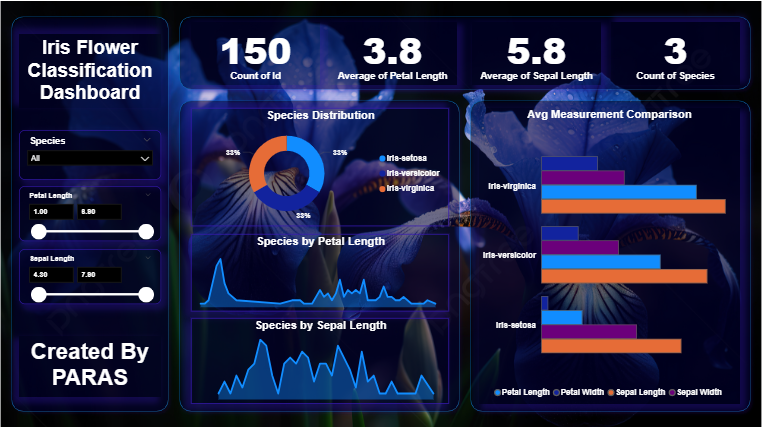

# 🌸 Iris Flower Classification Dashboard

## 📌 Project Overview
This project is an **interactive Power BI dashboard** that visualizes the **Iris Flower Dataset** to classify and explore different species of iris flowers based on their **petal** and **sepal** measurements.  
The dashboard is visually enhanced with a custom **floral background** and provides dynamic filtering for better user experience.

---

## 📊 Features
- **Species Filter:** Select any species or view all together.
- **Petal & Sepal Length Range Sliders:** Filter flowers based on measurement ranges.
- **Key Metrics:**
  - Total records count
  - Average petal length
  - Average sepal length
  - Number of unique species
- **Visualizations:**
  - Species distribution donut chart
  - Petal length distribution
  - Sepal length distribution
  - Average measurement comparison bar chart
- **Custom Theme:** Dark-themed UI with floral background for better visual appeal.

---

## 🗂 Dataset
**File:** `Iris.csv`  
**Columns:**
- `Id` – Unique identifier
- `SepalLengthCm` – Sepal length in cm
- `SepalWidthCm` – Sepal width in cm
- `PetalLengthCm` – Petal length in cm
- `PetalWidthCm` – Petal width in cm
- `Species` – Iris flower species (Setosa, Versicolor, Virginica)

---

## 🛠 Tools & Technologies
- **Power BI** – Dashboard design & data visualization
- **Dataset** – Iris dataset (CSV format)
- **Custom Background** – Floral theme image
- **Data Source Connection** – CSV file import in Power BI

---

## 📷 Project Preview
**Dashboard Screenshot:**  

---

## 🚀 How to Use
1. Download the `.pbix` file from this repository.
2. Open it in **Power BI Desktop**.
3. Ensure the `Iris.csv` dataset is in the correct path or update the data source in Power BI.
4. Use the filters and sliders to explore the data.

---

## 📌 Insights
- **Setosa** generally has the smallest petal length and width.
- **Virginica** tends to have the largest petal measurements.
- The dataset is evenly distributed among three species.

---

## 📄 Files in Repository
- `Iris Flower Classification.pbix` – Power BI dashboard file
- `Iris.csv` – Dataset
- `BackGround.png` – Custom floral background
- `Dashboard.PNG` – Dashboard screenshot
- `README.md` – Documentation

---

## ✍ Author
**Created by:** Paras Chaturvedi  
Data Analyst & Visualization Enthusiast
