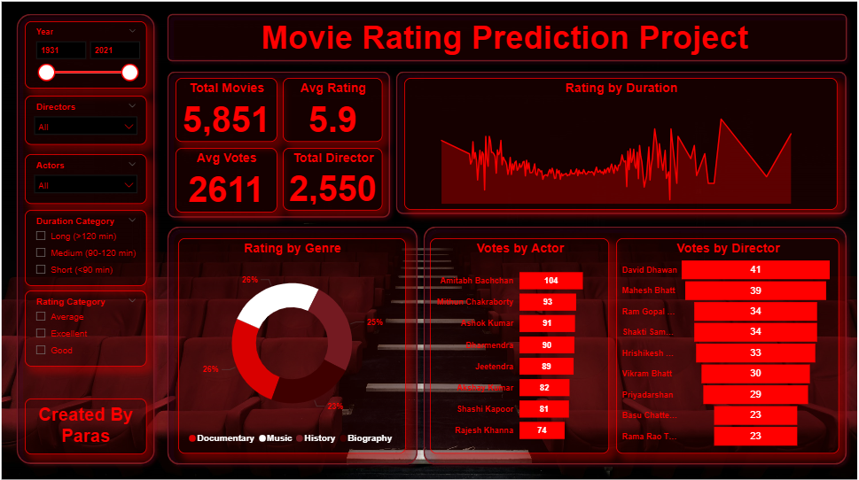

<!-- README.md starts here -->
<h1>🎬 Movie Rating Prediction Project</h1>

<h2>📌 Project Summary</h2>

This Power BI project analyzes Indian movie data from IMDb and builds an ML model to <strong>predict movie ratings</strong> based on features like <strong>genre, director, and actors</strong>. The dashboard visualizes key insights, trends, and contributors to movie ratings.

<h2>📂 Files Included</h2>
<table>
<tr><th>File</th><th>Description</th></tr>
<tr><td><code>IMDb Movies India.csv</code></td><td>Raw dataset containing movies from IMDb</td></tr>
<tr><td><code>MOVIE RATING.pbix</code></td><td>Power BI dashboard file</td></tr>
<tr><td><code>dashboard.PNG</code></td><td>Screenshot of the final dashboard</td></tr>
<tr><td><code>Background.jpg</code></td><td>Custom background used in the dashboard</td></tr>
</table>

<h2>💡 Key Features</h2>
<ul>
<li>📊 <strong>Interactive Power BI Dashboard</strong>
  <ul>
    <li>Filter by year, director, actor, duration category, and rating category</li>
    <li>Visuals: Line charts, bar charts, donut charts </li>
    <li>Metrics: Total Movies, Average Rating, Votes, and Top Contributors</li>
  </ul>
</li>
<li>🔍 <strong>Data Analysis & Preprocessing</strong>
  <ul>
    <li>Cleaned and transformed raw text columns</li>
    <li>Created custom fields like <code>DurationCategory</code> and <code>RatingCategory</code></li>
  </ul>
</li>
<li>🤖 <strong>Machine Learning (Planned)</strong>
  <ul>
    <li>Build a regression model to predict movie ratings based on:</li>
    <li>Genre(s), Director, Lead Actors</li>
  </ul>
</li>
</ul>

<h2>🔧 Tech Stack</h2>
<ul>
<li>Power BI (Data Cleaning + Visualization)</li>
<li>Python (Planned for ML)</li>
<li>Excel (Initial data inspection)</li>
<li>GitHub (Version control & portfolio)</li>
</ul>

<h2>📈 Insights from Dashboard</h2>
<ul>
<li>🎥 Most movies are under the Medium (90–120 min) duration</li>
<li>⭐ Average IMDb rating: 5.9</li>
<li>👥 Most voted actors include Amitabh Bachchan, Mithun, and Ashok Kumar</li>
<li>🎬 Popular genres include Documentary and Music</li>
</ul>

<h2>🧠 What's Next?</h2>
<ul>
<li>Train a regression model using scikit-learn or XGBoost</li>
<li>Predict ratings for unseen or upcoming movies</li>
<li>Add ML model results back into Power BI using Python visuals</li>
</ul>

<h2>🙋‍♂️ Created By</h2>

<strong>Paras Chaturvedi</strong> Aspiring Data Analyst Learning Data Science with real projects

<h2>📌 Preview</h2>

